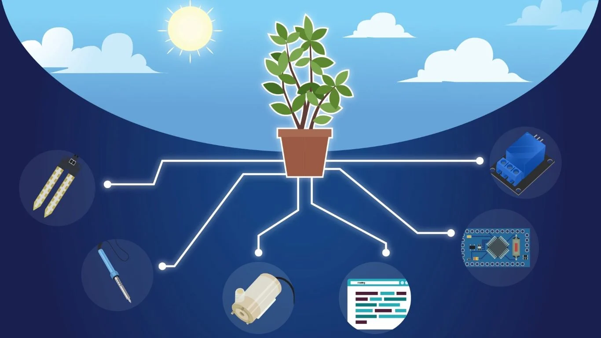

# PLANT WATERING SYSTEM

IoT Smart Plant Watering System is a great way to automate watering for plants. This watering system uses sensors to detect when a plant needs water and then sends a signal to a water pump to start watering the plant. This system is very easy to set up and can be controlled using a smartphone or computer.

