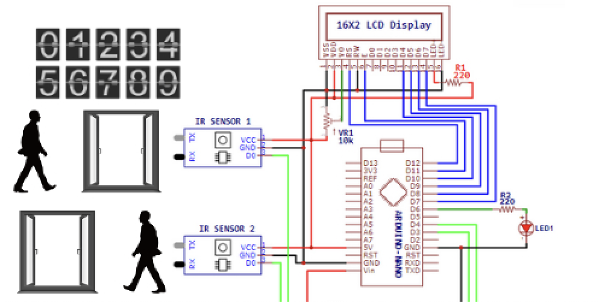

# PLANT WATERING SYSTEM

The IoT-Based Visitor Counter System is a cutting-edge project designed to efficiently count and manage visitors entering and exiting a particular location, such as a building, store, or public space. This innovative system leverages Internet of Things (IoT) technology to provide accurate and real-time visitor count data, allowing businesses and organizations to make data-driven decisions, enhance security, and optimize their operations.

